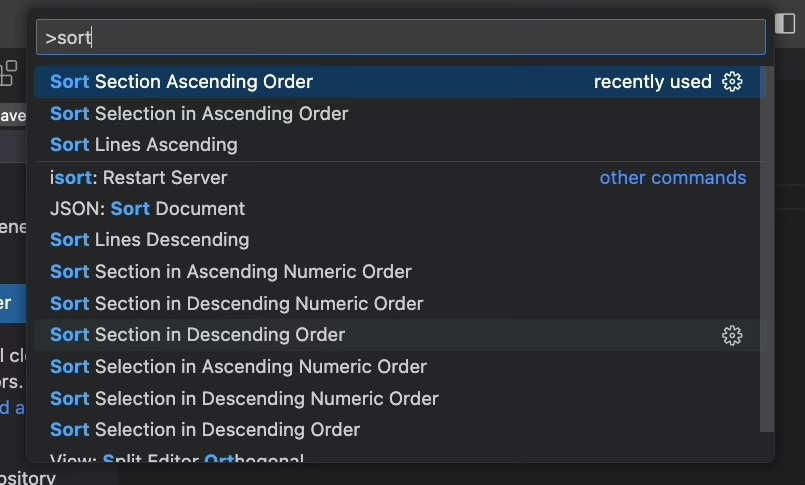
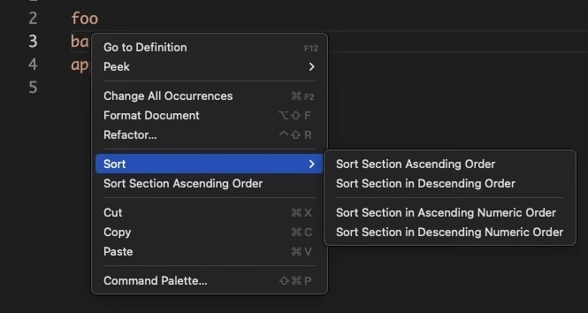
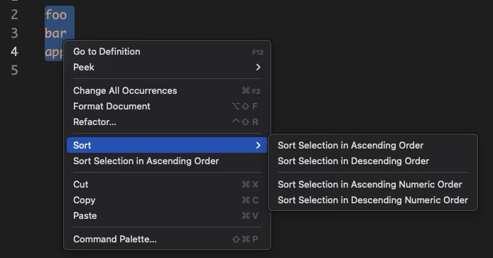

# Sort Sections

A [Visual Studio Code](https://code.visualstudio.com) extension that lets you easily sort lines within sections of text.

## Features

This extension provides commands via the Command Palette (⇧⌘P), as well as context menu items (right click on some text) to sort lines of text. Variations, both in ascending and descending order:

* Lexicographical - lexicographical, according to your locale.
* Numerical - sorts according to the first numeric value on a line. NaN is ordered before numbers. Non-numeric values are also ordered before numbers.

From the Command Palette (⇧⌘P):

From the context menu (right-click on text in the editor).

If you have selected some text before right-clicking, the context menu will change slightly with the assumption that you wish to sort all of the sections of text within the selection:

Sorting a selection sorts all of the sections (independently) within the selected area, while sorting by section just sorts the section the cursor is in. A section is defined as a group of non-blank lines between blank lines of text.

## Release Notes

Everything related to versions and their release notes can be found in the changelog.
